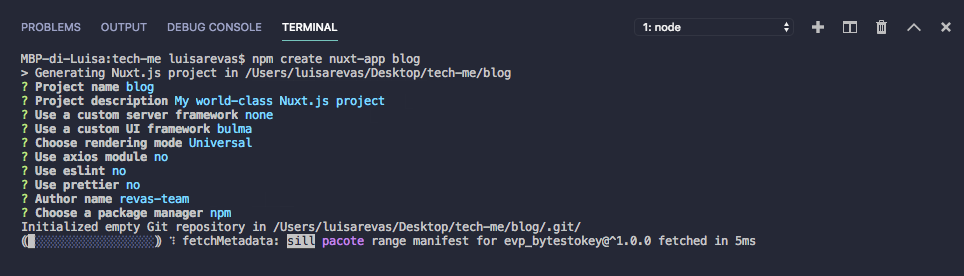
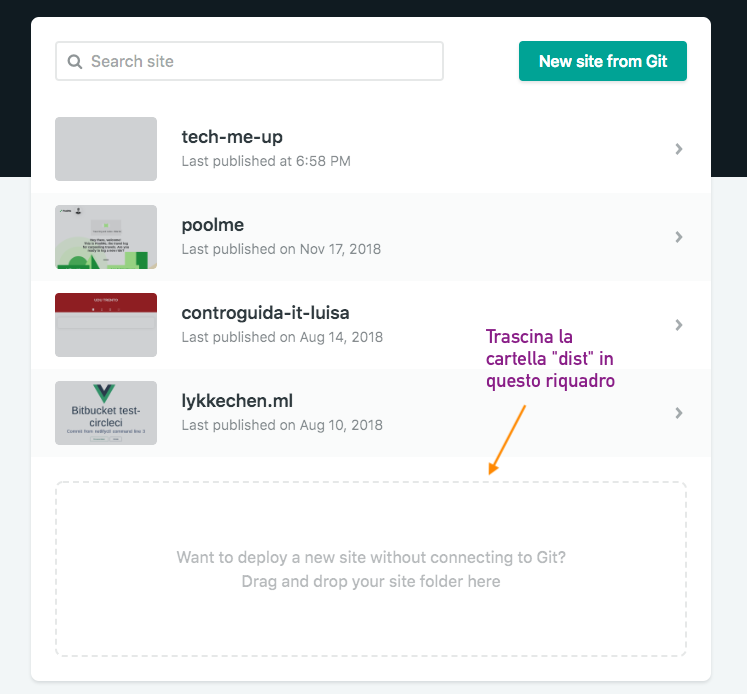

# TechMeUp

**TechMeUp** è un Workshop su come realizzare il proprio blog personale utilizzando Nuxt.js.
[Nuxt.js](https://nuxtjs.org/) è un framework frontend basato su Vue.js che ti permette di creare in modo semplice e intuitivo siti web e applicazioni, grazie al suo sistema di gestione di pagine e componenti.

Vai su questo link per avere un anteprima di quello che creeremo [https://tech-me-up.netlify.com/](https://tech-me-up.netlify.com/)

## Prerequisiti

Prima di iniziare devi aver installato sul pc **2 programmi**:

1. [Node.js](https://nodejs.org/it/download/)
2. Un editor per scrivere codice, ti consigliamo [Visual Studio Code](https://code.visualstudio.com/download)

## Avvio del progetto di Nuxt.js

1. Vai nel desktop e crea una cartella con il nome `tech-me-up`: sarà la cartella dove creeremo il blog
2. Avvia il programma **Visual Studio Code**
3. Da **Visual Studio Code** vai `File > Apri cartella...` e seleziona `tech-me-up`
4. Apri il terminale da **Visual Studio Code** da `Visualizza > Terminale integrato`
5. Digita  `npm create nuxt-app blog`, questo è un comando interattivo che ti porrà alcune domande. Grazie a questo processo otterai un esempio di progetto Nuxt.js, già funzionante, da cui partire per creare il tuo sito.
    > Il **terminale** è un programma già installato dal quale puoi comunicare con il computer in **modo testuale** per esempio puoi avviare programmi, navigare nelle cartelle, creare cartelle, e tante altre cose.

    - Attendi qualche secondo finchè non ti compariranno sul termnale una serie di domande per configurare il progetto:
    - Ti serviranno solo le impostazioni di default quindi per ogni comando premi sempre `invio` eccetto per il quarto comando$$:
    - `? Use a custom UI framework` a questo comando seleziona `Bulma`
    - 

6. Digita `cd blog` per entrare nella cartella appena creata e premi `invio`
7. Per aprire il tuo sito sul tuo PC (in locale) bisognerà avviare il server di sviluppo tramite il comando:
    `npm run dev`

## Struttura di un progetto Nuxt

### La cartella **pages**

La cartella **pages** è il cuore di un progetto Nuxt. Al suo interno potrai creare file e cartelle che diventeranno le pagine e sottopagine del tuo sito.

Nella cartella **pages**, troverai già un file `index.vue`.
>***Index*** è il nome standard che viene assegnato ai file per rappresentare la home page, ovvero la prima pagina che viene visualizzata quando si naviga su un sito.

Nella cartella **pages** puoi creare quanti file e cartelle desideri, l'importante è che tutti i file che aggiungi terminino con `.vue`.
> Ad esempio: Se vuoi creare una pagina *contatti* che venga visualizzata sul tuo sito attraverso l'url `https://il-mio-sito/contatti`, ti basta creare in pages un file `contatti.vue`.

### Struttura file **.vue**

Un file `.vue` è composto da 3 parti:

- **Template** contiene i tag *HTML*, che definiscono la struttura di una pagina web dal titolo, ai paragrafi, all'impaginazione.
- **Script** contiene tutte le funzioni per rendere interattivo il tuo sito, utilizzando *Javascript*.
- **Style** contiene tutti gli stili in *CSS*. Il *CSS* viene utilizzato per gestire tutta la parte estetica di una pagina web come i colori, i caratteri, lo sfondo.
  > Per il CSS oggi utilizzeremo [Bulma](https://bulma.io/) che ti mette a disposizione gli strumenti per costruire la tua pagina web, in particolare ti dà degli stili CSS base.

## Ora si comincia

Ora andiamo a togliere il codice di esempio e cominciamo a modellare la homepage.
Sostituisci tutto il contenuto di `index.vue` con:

``` bash
<template>
  <div>

  </div>
</template>
```

## Personalizza il tuo sito

### Hero

L'elemento **hero** è una sezione, simile a un banner, che puoi aggiungere al tuo sito.
Se vuoi puoi personalizzare la sua dimensione e aggiungere un colore di sfondo.

``` bash
<section class="hero is-medium is-primary is-bold">
  <div class="hero-body">
    <div class="container">
      <h1 class="title">Ciao!</h1>
      <h2 class="subtitle">Questo è un blog</h2>
    </div>
  </div>
</section>
```

### Card

La **card** è un riquadro a cui puoi aggiungere del testo e un'immagine

``` bash
<div class="card">
  <div class="card-image">
    <figure class="image is-4by3">
      
    </figure>
  </div>
  <div class="card-content">
    <div class="content">
      <h1>Arduino</h1>Lorem ipsum dolor sit amet, consectetur adipiscing elit.
      Phasellus nec iaculis mauris.
      <a>@girlscodeit</a>.
      <a href="#">#css</a>
      <a href="#">#responsive</a>
      <br>
      <time datetime="2016-1-1">11:09 PM - 1 Jan 2019</time>
    </div>
  </div>
</div>
```

### Layout di base

Come avrai notato, la card non è centrata. Per avere dei contenuti più ordinati devi infatti affidarti agli elementi che permettono di strutturare e organizzare i contenuti, ovvero **section** e **div**.
> Div e section sono contenitori che racchiudono al loro interno altri elementi e permettono di dividere in sezioni la pagina.

- Crea una nuova `section`, cioè un blocco distinto all'interno della pagina.
- Al suo interno crea un `div` con classe `container`. È una classe di Bulma che ti permette di centrare il contenuto orizzontalmente.

``` bash
<section class="section">
  <div class="container">
    Aggiungi quello che desideri
  </div>
</section>

```

### Colonne

Per poter avere 2 card una accanto all'altra e non a capo puoi creare delle colonne.

``` bash
<div class="columns">
  <div class="column">
    Prima colonna
  </div>
  <div class="column">
    Seconda colonna
  </div>
  <div class="column">
    Terza colonna
  </div>
</div>
```

### Creiamo la pagina per un post

Per creare una sotto pagina basta creare nella cartella `pages` un'altra cartella che denomineremo `posts`.

TODO

### Navbar

La navbar è il menù che solitamente trovi in cima alla pagina che ti mostra le sezioni o le pagine presenti sul sito.

``` bash
<nav class="navbar" role="navigation" aria-label="main navigation">
  <div class="navbar-brand">
    <a class="navbar-item">
      <h1 class="title">Girlscodeit</h1>
    </a>
    <a
      role="button"
      class="navbar-burger burger"
      aria-label="menu"
      aria-expanded="false"
      data-target="navbarBasicExample">
      <span aria-hidden="true"></span>
      <span aria-hidden="true"></span>
      <span aria-hidden="true"></span>
    </a>
  </div>
  <div id="navbarBasicExample" class="navbar-menu">
    <div class="navbar-start">
      <a class="navbar-item">Home</a>
      <a class="navbar-item" href="/#blog">Blog</a>
      <nuxt-link to="contatti" class="navbar-item">Contatti</nuxt-link>
    </div>
  </div>
</nav>
```

#### Collegare le **pagine .vue** fra loro

In Nuxt.js esiste un componente che serve per creare dei collegamenti tra pagine e sottopagine. Per esempio in questo caso rimandiamo alla pagina `posts`:

`<nuxt-link to="/posts">Blog</nuxt-link>`

Come vedrai è un tag composto da 3 parti:

- **Tag** `<nuxt-link>`
- **To**: attributo in cui puoi indicare la pagina con cui vuoi creare il collegamento
- **Link**: l'elemento visibile sul sito che se cliccato ti porterà alla pagina
  > Può essere del semplice testo oppure un elemento più complesso come un'immagine, una card, un bottone.

## Comandi utili

### Salvataggio automatico

- Per attivare il  **Salvataggio automatico**  vai --> `File` > `Autosave`

### Riordinare e formattare il codice

Avere un codice ordinato e indentato bene ti aiuta a capire quale elemento è contenuto in un altro elemento e quindi ti permette di modificare e aggiungere codice più facilmente.

In **Visual Studio Code** c'è un comando che ti indenta automaticamente il codice, per farlo ti basta fare:

- Tasto destro `Formatta Documento`

#### Estensione per i file .vue

**Visual Studio Code** può essere personalizzato e possono essere installate delle estensioni che facilitano e rendono più leggibile il codice che si sta scrivendo.

Per i file `.vue` esiste **Vuetur** che rende il tuo codice più leggibile e ti fornisce suggerimenti su come scrivere e strutturare correttamente il tuo file.

Se vuoi installarlo ti basta andare nella sezione estensioni di **Visual Studio Code** e cercare **Vetur**

## Prepara il tuo sito alla pubblicazione

- Per rendere il sito comprensibile dai browser come Chrome e Firefox, devi trasformare il codice da Vue a HTML e CSS.
  Per fare questo apri il terminale ed esegui questo comando:
  `npm run generate`

## Pubblicazione dei sito con Netlify

Finora il sito che hai creato è visibile solamente sul tuo pc. Per permettere anche agli altri di visitarlo e navigarci, è necessario pubblicare il sito online.

Per pubblicare ti servirà un servizio di **hosting**, ovvero un servizio che ti metta a disposizione uno spazio online.
  > Oggi utilizzerai [Netlify](https://www.netlify.com) un servizio di hosting gratuito.
  
- Inizia creando un account su Netlify, (è gratuito 😊)
- Una volta che avrai completato la procedura di creazione e avrai verificato il tuo account, accedi a Netlify e trascina la cartella di nome `dist` nel riquadro tratteggiato (come descritto alla sezione "*Prepara il tuo sito alla pubblicazione*")



- Ora il tuo sito è già online, può accederci cliccando sul link in alto a sinistra 🎉🎉

### Cambiare nome del sito

- Puoi anche modificare il nome del link (la parte prima di `.netlify.com`)
- Ti basta andare in `Site Settings` e cliccare su `Change site name`


## TODO

I vari passi a grandi linee
Glossario
Comandi utili 